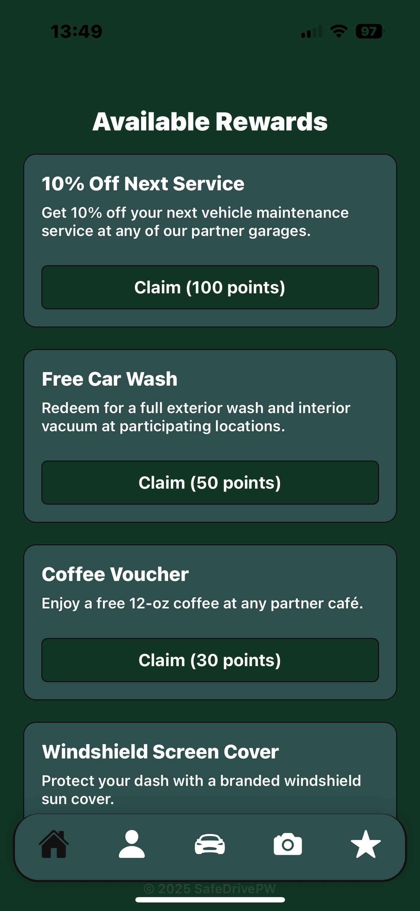
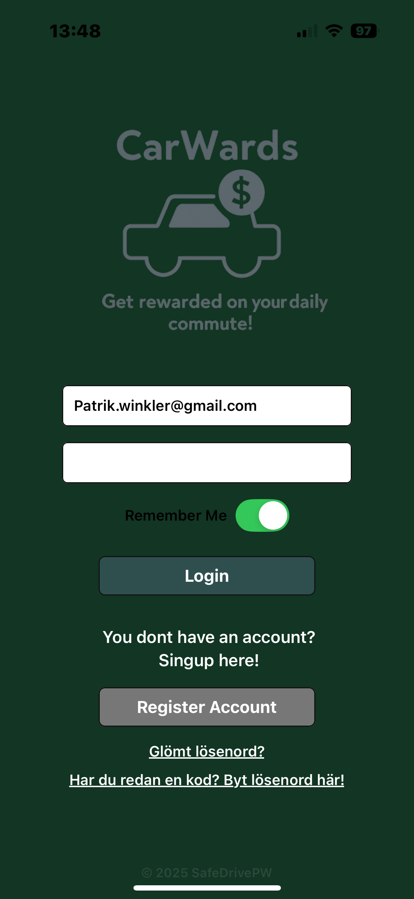
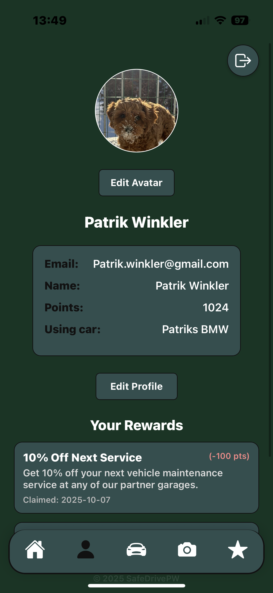
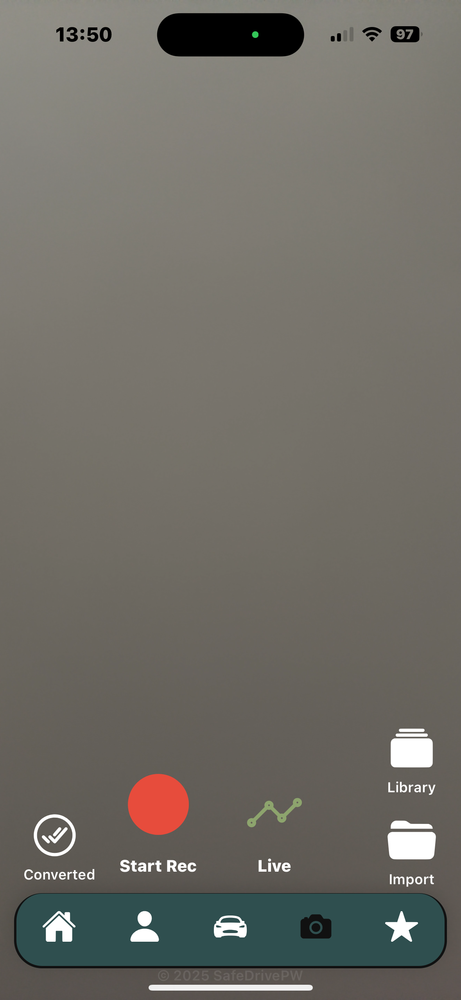
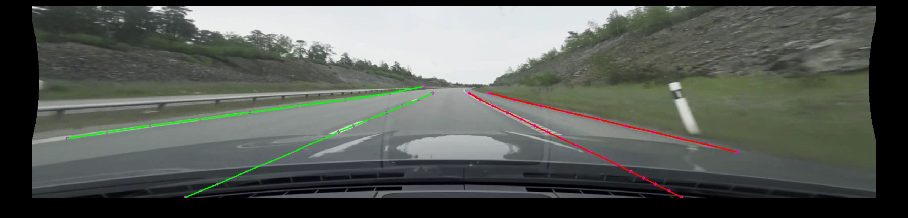
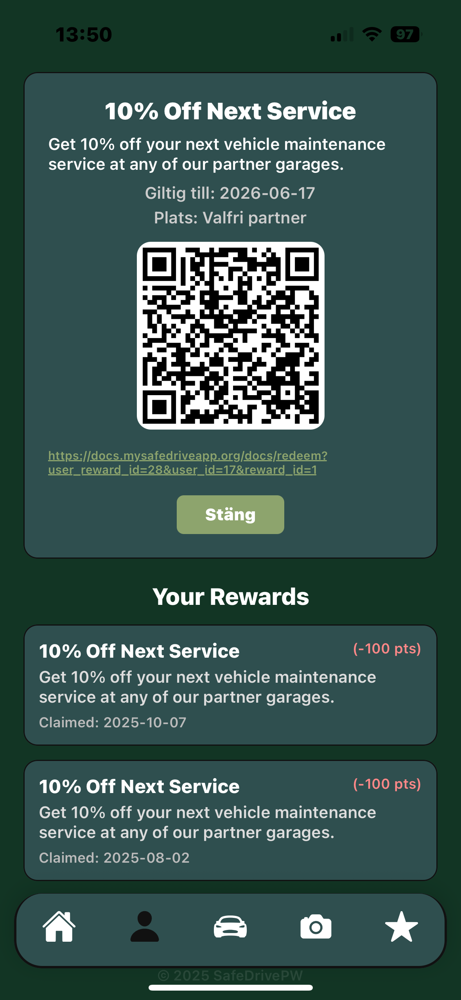
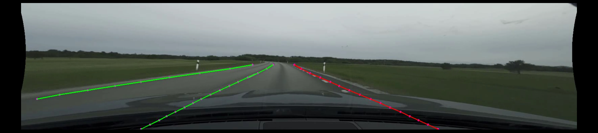
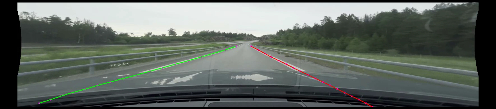

# SafeDriveApp 🚗

A React Native mobile application that helps drivers stay safe on the road using AI-powered lane detection technology. Users earn rewards for maintaining proper lane discipline and can track their driving performance over time.

## 📱 Screenshots

<div align="center">

| Home Screen | Login Screen | Profile Screen |
|-------------|--------------|----------------|
|  |  |  |

| Camera Interface | Lane Detection AI | Enhanced Profile |
|------------------|-------------------|------------------|
|  |  |  |

### 🤖 AI Lane Detection in Action

| Lane Detection Example 1 | Lane Detection Example 2 | Lane Detection Example 3 |
|-------------------------|-------------------------|-------------------------|
|  |  |  |

</div>

*SafeDriveApp features a modern, intuitive interface with real-time AI-powered lane detection to help drivers stay safe on the road.*

## 🎥 Demo

<!-- Add a GIF or video demonstration here -->
*Coming soon: Live demonstration of AI lane detection in action*

## 🌟 Features

### Current Features
- **AI Lane Detection**: Real-time lane detection using ONNX machine learning models
- **Driving Rewards System**: Earn points for safe driving behaviors
- **User Authentication**: Secure login and registration system
- **Driving Session Tracking**: Monitor and record driving sessions
- **Camera Integration**: Real-time video processing for lane analysis
- **User Profiles**: Personal driving statistics and achievements
- **Quiz System**: Safety knowledge testing with rewards

### Planned Features
- **Advanced Analytics**: Detailed driving behavior analysis
- **Social Features**: Compare performance with friends
- **Route Optimization**: AI-suggested safer routes
- **Weather Integration**: Adjust safety recommendations based on conditions

## 🏗️ Tech Stack

### Frontend (Mobile App)
- **React Native** with **Expo** - Cross-platform mobile development
- **TypeScript** - Type-safe JavaScript development
- **React Navigation** - Navigation library
- **Expo Camera** - Camera functionality
- **ONNX Runtime** - Machine learning model inference

### Backend (API Server)
- **FastAPI** - Modern Python web framework
- **SQLAlchemy** - Database ORM
- **Alembic** - Database migrations
- **SQLite/PostgreSQL** - Database storage
- **Passlib** - Password hashing
- **OpenCV** - Computer vision processing

### Machine Learning
- **ONNX Models** - Optimized neural network inference
- **Lane Detection Models** - Custom trained lane detection
- **Depth Estimation** - MonoDepth2 for depth perception

## 🚀 Getting Started

### Prerequisites
- Node.js 18+ and npm/yarn
- Python 3.8+
- Expo CLI (`npm install -g @expo/cli`)
- Android Studio (for Android development) or Xcode (for iOS development)

### Installation

1. **Clone the repository**
   ```bash
   git clone https://github.com/bossebrutal/safedriveapp.git
   cd safedriveapp
   ```

2. **Install frontend dependencies**
   ```bash
   npm install
   ```

3. **Set up Python backend**
   ```bash
   cd backend
   python -m venv venv
   source venv/bin/activate  # On Windows: venv\Scripts\activate
   pip install -r requirements.txt
   ```

4. **Initialize the database**
   ```bash
   cd backend
   python create_database.py
   alembic upgrade head
   ```

5. **Start the backend server**
   ```bash
   cd backend
   python main.py
   ```

6. **Start the mobile app**
   ```bash
   # In the root directory
   expo start
   ```

### Environment Setup

Create a `.env` file in the backend directory with your configuration:
```env
DATABASE_URL=sqlite:///./safedriveapp.db
SECRET_KEY=your-secret-key-here
```

### Machine Learning Models

**Important**: The ONNX model files are large (250MB+) and are excluded from this repository. To use the lane detection features:

1. **Download the model files** (contact maintainer or train your own)
2. **Place them in the correct directories**:
   ```
   assets/models/lane_net.onnx
   assets/models/monodepth2_kitti.onnx
   ```
3. **Alternative**: Use Git LFS to track large files:
   ```bash
   git lfs install
   git lfs track "*.onnx"
   git add .gitattributes
   ```

## 📱 Usage

1. **Registration**: Create a new account or login with existing credentials
2. **Camera Permissions**: Grant camera permissions for lane detection
3. **Start Driving**: Begin a driving session to start earning points
4. **Lane Detection**: Keep your vehicle within lane markers to earn rewards
5. **View Stats**: Check your driving performance and accumulated points
6. **Take Quizzes**: Complete safety quizzes to earn additional rewards

## 🏛️ Architecture

```
safedriveapp/
├── App.tsx                 # Main app entry point
├── navigation/            # Navigation configuration
├── screens/              # App screens (Login, Home, Profile, etc.)
├── components/           # Reusable UI components
├── utils/               # API utilities and helpers
├── assets/              # Images, fonts, models
│   └── models/         # ONNX machine learning models
├── backend/             # FastAPI backend server
│   ├── main.py         # Backend entry point
│   ├── models.py       # Database models
│   ├── schemas.py      # Pydantic schemas
│   ├── repository.py   # Database operations
│   └── auth.py         # Authentication logic
└── machinelearning/     # ML model development (excluded from repo)
```

## 🤖 Machine Learning Models

The app uses pre-trained ONNX models for:
- **Lane Detection**: Identifies lane boundaries in real-time
- **Depth Estimation**: MonoDepth2 model for spatial awareness

Models are optimized for mobile inference and stored in `assets/models/`.

## 🔧 Development

### Running Tests
```bash
# Frontend tests
npm test

# Backend tests
cd backend
python -m pytest
```

### Building for Production
```bash
# Build APK for Android
expo build:android

# Build for iOS
expo build:ios
```

## 🤝 Contributing

1. Fork the repository
2. Create a feature branch (`git checkout -b feature/amazing-feature`)
3. Commit your changes (`git commit -m 'Add amazing feature'`)
4. Push to the branch (`git push origin feature/amazing-feature`)
5. Open a Pull Request

## 📄 License

This project is licensed under the MIT License - see the [LICENSE](LICENSE) file for details.

## 🙏 Acknowledgments

- Lane detection research and models
- React Native and Expo communities
- FastAPI framework contributors
- Computer vision and ML research community

## 📞 Contact

**Developer**: Patrik Winkler  
**GitHub**: [@bossebrutal](https://github.com/bossebrutal)  
**Project Link**: [https://github.com/bossebrutal/safedriveapp](https://github.com/bossebrutal/safedriveapp)

---

**Note**: This project is under active development. Features and documentation may change as the project evolves.